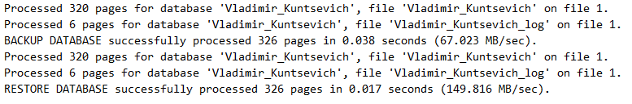
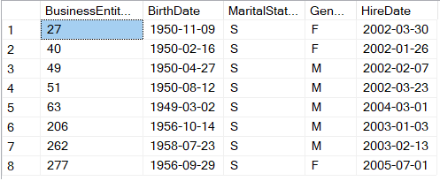
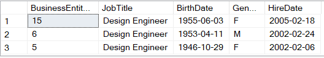
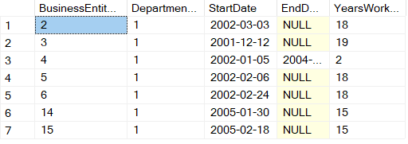

# Вариант 8
# Кунцевич Владимир, 751001

## Задание 1

## Задание 2

1. Вывести на экран холостых сотрудников, которые родились раньше 1960 (включая 1960 год).
2. Вывести на экран сотрудников, работающих на позиции ‘Design Engineer’, отсортированных в порядке убывания принятия их на работу.
3. Вывести на экран количество лет, отработанных каждым сотрудником отделе ‘Engineering’ ([DepartmentID] = 1). Если поле EndDate = NULL это значит, что сотрудник работает в отделе по настоящее время.

### Результат 2.1

### Результат 2.2

### Результат 2.3
