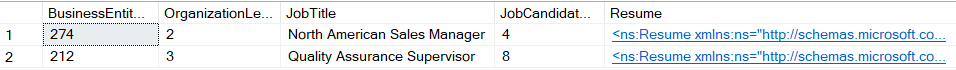
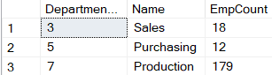
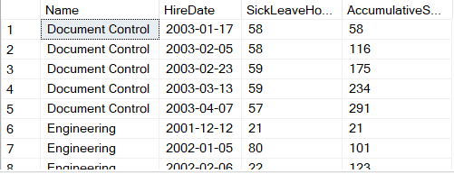
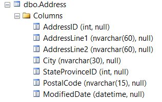
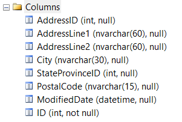
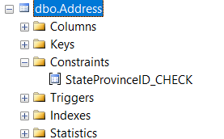
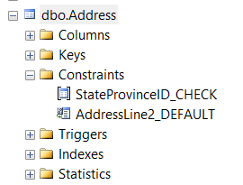
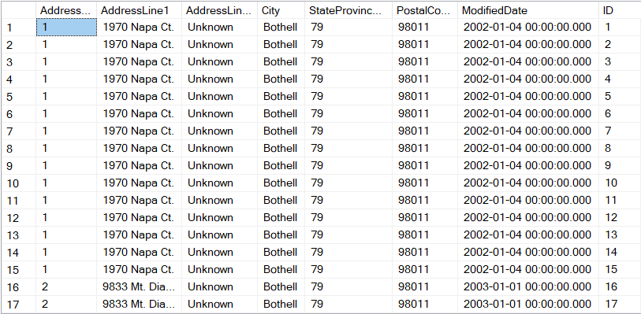
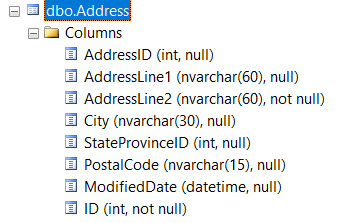

# Вариант 8
# Кунцевич Владимир, 751001

## Задание 1

1. Вывести на экран список сотрудников которые подавали резюме при трудоустройстве.
2. Вывести на экран названия отделов, в которых работает более 10-ти сотрудников.
3. Вывести на экран накопительную сумму часов отпуска по причине болезни (SickLeaveHours) в рамках каждого отдела. Сумма должна накапливаться по мере трудоустройства сотрудников (HireDate).

### Результат 1.1

### Результат 1.1

### Результат 1.1

## Задание 2

1. создайте таблицу dbo.Address с такой же структурой как Person.Address, кроме полей geography, uniqueidentifier, не включая индексы, ограничения и триггеры;

2. используя инструкцию ALTER TABLE, добавьте в таблицу dbo.Address новое поле ID с типом данных INT, имеющее свойство identity с начальным значением 1 и приращением 1. Создайте для нового поля ID ограничение UNIQUE;

3. используя инструкцию ALTER TABLE, создайте для таблицы dbo.Address ограничение для поля StateProvinceID, чтобы заполнить его можно было только нечетными числами;

4. используя инструкцию ALTER TABLE, создайте для таблицы dbo.Address ограничение DEFAULT для поля AddressLine2, задайте значение по умолчанию ‘Unknown’;

5. заполните новую таблицу данными из Person.Address. Выберите для вставки только те адреса, где значение поля Name из таблицы CountryRegion начинается на букву ‘а’. Также исключите данные, где StateProvinceID содержит четные числа. Заполните поле AddressLine2 значениями по умолчанию;

6. измените поле AddressLine2, запретив вставку null значений.

### Результат 2.1

### Результат 2.2

### Результат 2.3

### Результат 2.4

### Результат 2.5

### Результат 2.6
